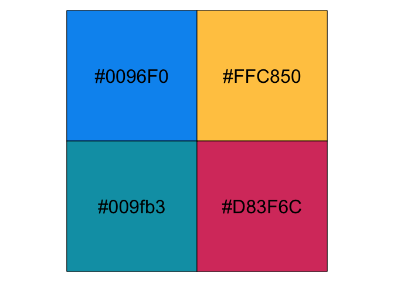
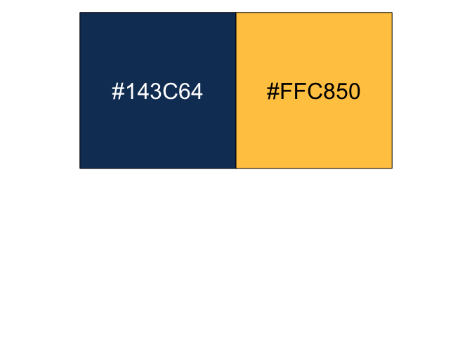

<!-- README.md is generated from README.Rmd. Please edit that file -->

# MPAcolors

<!-- badges: start -->
<!-- badges: end -->

The goal of MPAcolors is to …

## Installation

You can install the development version of MPAcolors from
[GitHub](https://github.com/) with:

``` r
# install.packages("devtools")
devtools::install_github("vrognas/MPAcolors")
```

## Examples

``` r
library(MPAcolors)
```

### Complementary palette

``` r
scales::show_col(mpa_palette("complementary"), cex_label = 2)
```



### Highlight palette

``` r
scales::show_col(mpa_palette("highlight"), cex_label = 2)
```


